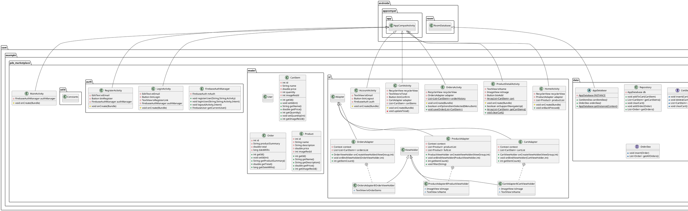

```plantuml
@startuml
class com.example.pde_marketplace.data.Repository {
- AppDatabase db
+ void addToCart(CartItem)
+ List<CartItem> getCartItems()
+ void clearCart()
+ void addOrder(Order)
+ List<Order> getOrders()
}


class com.example.pde_marketplace.ui.CartActivity {
- RecyclerView recyclerView
- TextView tvTotal
- Button btnConfirm
- CartAdapter adapter
- List<CartItem> cartItems
# void onCreate(Bundle)
- void updateTotal()
}


class com.example.pde_marketplace.model.User {
}
class com.example.pde_marketplace.auth.FirebaseAuthManager {
- FirebaseAuth mAuth
+ void registerUser(String,String,Activity)
+ void loginUser(String,String,Activity,Intent)
+ void logout(Activity,Intent)
+ FirebaseUser getCurrentUser()
}


class com.example.pde_marketplace.auth.LoginActivity {
- EditText etEmail
- Button btnLogin
- TextView tvRegisterLink
- FirebaseAuthManager authManager
# void onCreate(Bundle)
}


class com.example.pde_marketplace.ui.AccountActivity {
- TextView tvEmail
- Button btnLogout
- FirebaseAuth auth
# void onCreate(Bundle)
}


class com.example.pde_marketplace.model.CartItem {
- int id
- String name
- double price
- int quantity
- int imageResId
+ int getId()
+ void setId(int)
+ String getName()
+ double getPrice()
+ int getQuantity()
+ void setQuantity(int)
+ int getImageResId()
}


class com.example.pde_marketplace.model.Order {
- int id
- String productSummary
- double total
- long dateMillis
+ int getId()
+ void setId(int)
+ String getProductSummary()
+ double getTotal()
+ long getDateMillis()
}


class com.example.pde_marketplace.ui.HomeActivity {
- RecyclerView recyclerView
- ProductAdapter adapter
- List<Product> productList
# void onCreate(Bundle)
+ void onBackPressed()
}


class com.example.pde_marketplace.ui.ProductAdapter {
- Context context
- List<Product> productList
- List<Product> fullList
+ ProductViewHolder onCreateViewHolder(ViewGroup,int)
+ void onBindViewHolder(ProductViewHolder,int)
+ int getItemCount()
+ void filter(String)
}


class com.example.pde_marketplace.ui.ProductAdapter$ProductViewHolder {
~ ImageView ivImage
~ TextView tvName
}

class com.example.pde_marketplace.ui.OrdersAdapter {
- Context context
- List<List<CartItem>> ordersList
+ OrderViewHolder onCreateViewHolder(ViewGroup,int)
+ void onBindViewHolder(OrderViewHolder,int)
+ int getItemCount()
}


class com.example.pde_marketplace.ui.OrdersAdapter$OrderViewHolder {
~ TextView tvOrderItems
}

class com.example.pde_marketplace.ui.CartAdapter {
- Context context
- List<CartItem> cartList
+ CartViewHolder onCreateViewHolder(ViewGroup,int)
+ void onBindViewHolder(CartViewHolder,int)
+ int getItemCount()
}


class com.example.pde_marketplace.ui.CartAdapter$CartViewHolder {
~ ImageView ivImage
~ TextView tvName
}

class com.example.pde_marketplace.MainActivity {
- FirebaseAuthManager authManager
# void onCreate(Bundle)
}


abstract class com.example.pde_marketplace.data.AppDatabase {
- {static} AppDatabase INSTANCE
+ {abstract}CartItemDao cartItemDao()
+ {abstract}OrderDao orderDao()
+ {static} AppDatabase getInstance(Context)
}


interface com.example.pde_marketplace.data.CartItemDao {
~ void insert(CartItem)
~ void delete(CartItem)
~ List<CartItem> getAllItems()
~ void clearCart()
}

interface com.example.pde_marketplace.data.OrderDao {
~ void insert(Order)
~ List<Order> getAllOrders()
}

class com.example.pde_marketplace.model.Product {
- int id
- String name
- String description
- double price
- int imageResId
+ int getId()
+ String getName()
+ String getDescription()
+ double getPrice()
+ int getImageResId()
}


class com.example.pde_marketplace.ui.ProductDetailActivity {
- TextView tvName
- ImageView ivImage
- Button btnAdd
- {static} ArrayList<CartItem> cart
# void onCreate(Bundle)
+ boolean onSupportNavigateUp()
+ {static} ArrayList<CartItem> getCartItems()
+ {static} void clearCart()
}


class com.example.pde_marketplace.utils.Constants {
}
class com.example.pde_marketplace.auth.RegisterActivity {
- EditText etEmail
- Button btnRegister
- FirebaseAuthManager authManager
# void onCreate(Bundle)
}


class com.example.pde_marketplace.ui.OrdersActivity {
- RecyclerView recyclerView
- OrdersAdapter adapter
- {static} List<List<CartItem>> orderHistory
# void onCreate(Bundle)
+ boolean onOptionsItemSelected(MenuItem)
+ {static} void saveOrder(List<CartItem>)
}


androidx.appcompat.app.AppCompatActivity <|-- com.example.pde_marketplace.ui.CartActivity
androidx.appcompat.app.AppCompatActivity <|-- com.example.pde_marketplace.auth.LoginActivity
androidx.appcompat.app.AppCompatActivity <|-- com.example.pde_marketplace.ui.AccountActivity
androidx.appcompat.app.AppCompatActivity <|-- com.example.pde_marketplace.ui.HomeActivity
com.example.pde_marketplace.ui.Adapter <|-- com.example.pde_marketplace.ui.ProductAdapter
com.example.pde_marketplace.ui.ProductAdapter +.. com.example.pde_marketplace.ui.ProductAdapter$ProductViewHolder
com.example.pde_marketplace.ui.ViewHolder <|-- com.example.pde_marketplace.ui.ProductAdapter$ProductViewHolder
com.example.pde_marketplace.ui.Adapter <|-- com.example.pde_marketplace.ui.OrdersAdapter
com.example.pde_marketplace.ui.OrdersAdapter +.. com.example.pde_marketplace.ui.OrdersAdapter$OrderViewHolder
com.example.pde_marketplace.ui.ViewHolder <|-- com.example.pde_marketplace.ui.OrdersAdapter$OrderViewHolder
com.example.pde_marketplace.ui.Adapter <|-- com.example.pde_marketplace.ui.CartAdapter
com.example.pde_marketplace.ui.CartAdapter +.. com.example.pde_marketplace.ui.CartAdapter$CartViewHolder
com.example.pde_marketplace.ui.ViewHolder <|-- com.example.pde_marketplace.ui.CartAdapter$CartViewHolder
androidx.appcompat.app.AppCompatActivity <|-- com.example.pde_marketplace.MainActivity
androidx.room.RoomDatabase <|-- com.example.pde_marketplace.data.AppDatabase
androidx.appcompat.app.AppCompatActivity <|-- com.example.pde_marketplace.ui.ProductDetailActivity
androidx.appcompat.app.AppCompatActivity <|-- com.example.pde_marketplace.auth.RegisterActivity
androidx.appcompat.app.AppCompatActivity <|-- com.example.pde_marketplace.ui.OrdersActivity
@enduml
```
