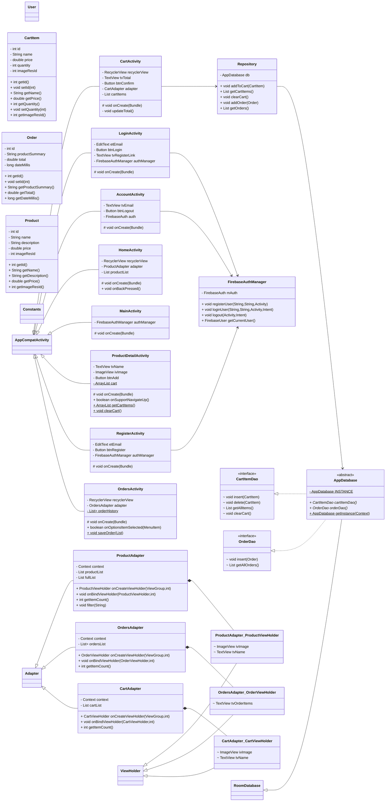

## Diagrama de Clases de la Aplicación del marketplace

```mermaid
classDiagram
    direction LR

    %% Definición de Clases con atributos y métodos
    class Repository {
        - AppDatabase db
        + void addToCart(CartItem)
        + List<CartItem> getCartItems()
        + void clearCart()
        + void addOrder(Order)
        + List<Order> getOrders()
    }
    
    class CartActivity {
        - RecyclerView recyclerView
        - TextView tvTotal
        - Button btnConfirm
        - CartAdapter adapter
        - List<CartItem> cartItems
        # void onCreate(Bundle)
        - void updateTotal()
    }
    
    class User {
    }
    
    class FirebaseAuthManager {
        - FirebaseAuth mAuth
        + void registerUser(String,String,Activity)
        + void loginUser(String,String,Activity,Intent)
        + void logout(Activity,Intent)
        + FirebaseUser getCurrentUser()
    }
    
    class LoginActivity {
        - EditText etEmail
        - Button btnLogin
        - TextView tvRegisterLink
        - FirebaseAuthManager authManager
        # void onCreate(Bundle)
    }
    
    class AccountActivity {
        - TextView tvEmail
        - Button btnLogout
        - FirebaseAuth auth
        # void onCreate(Bundle)
    }
    
    class CartItem {
        - int id
        - String name
        - double price
        - int quantity
        - int imageResId
        + int getId()
        + void setId(int)
        + String getName()
        + double getPrice()
        + int getQuantity()
        + void setQuantity(int)
        + int getImageResId()
    }
    
    class Order {
        - int id
        - String productSummary
        - double total
        - long dateMillis
        + int getId()
        + void setId(int)
        + String getProductSummary()
        + double getTotal()
        + long getDateMillis()
    }
    
    class HomeActivity {
        - RecyclerView recyclerView
        - ProductAdapter adapter
        - List<Product> productList
        # void onCreate(Bundle)
        + void onBackPressed()
    }
    
    class ProductAdapter {
        - Context context
        - List<Product> productList
        - List<Product> fullList
        + ProductViewHolder onCreateViewHolder(ViewGroup,int)
        + void onBindViewHolder(ProductViewHolder,int)
        + int getItemCount()
        + void filter(String)
    }

    class OrdersAdapter {
        - Context context
        - List<List<CartItem>> ordersList
        + OrderViewHolder onCreateViewHolder(ViewGroup,int)
        + void onBindViewHolder(OrderViewHolder,int)
        + int getItemCount()
    }

    class CartAdapter {
        - Context context
        - List<CartItem> cartList
        + CartViewHolder onCreateViewHolder(ViewGroup,int)
        + void onBindViewHolder(CartViewHolder,int)
        + int getItemCount()
    }

    class MainActivity {
        - FirebaseAuthManager authManager
        # void onCreate(Bundle)
    }

    class AppDatabase {
        <<abstract>>
        - AppDatabase INSTANCE$
        + CartItemDao cartItemDao()*
        + OrderDao orderDao()*
        + AppDatabase getInstance(Context)$
    }
    
    class CartItemDao {
        <<interface>>
        ~ void insert(CartItem)
        ~ void delete(CartItem)
        ~ List<CartItem> getAllItems()
        ~ void clearCart()
    }
    
    class OrderDao {
        <<interface>>
        ~ void insert(Order)
        ~ List<Order> getAllOrders()
    }

    class Product {
        - int id
        - String name
        - String description
        - double price
        - int imageResId
        + int getId()
        + String getName()
        + String getDescription()
        + double getPrice()
        + int getImageResId()
    }
    
    class ProductDetailActivity {
        - TextView tvName
        - ImageView ivImage
        - Button btnAdd
        - ArrayList<CartItem> cart$
        # void onCreate(Bundle)
        + boolean onSupportNavigateUp()
        + ArrayList<CartItem> getCartItems()$
        + void clearCart()$
    }
    
    class Constants {
    }
    
    class RegisterActivity {
        - EditText etEmail
        - Button btnRegister
        - FirebaseAuthManager authManager
        # void onCreate(Bundle)
    }
    
    class OrdersActivity {
        - RecyclerView recyclerView
        - OrdersAdapter adapter
        - List<List<CartItem>> orderHistory$
        # void onCreate(Bundle)
        + boolean onOptionsItemSelected(MenuItem)
        + void saveOrder(List<CartItem>)$
    }

    %% Definición de Clases Anidadas (Inner Classes)
    class ProductAdapter_ProductViewHolder {
        ~ ImageView ivImage
        ~ TextView tvName
    }
    
    class OrdersAdapter_OrderViewHolder {
        ~ TextView tvOrderItems
    }

    class CartAdapter_CartViewHolder {
        ~ ImageView ivImage
        ~ TextView tvName
    }

    %% Relaciones de Herencia (Generalización) y Implementación
    
    AppCompatActivity <|-- CartActivity
    AppCompatActivity <|-- LoginActivity
    AppCompatActivity <|-- AccountActivity
    AppCompatActivity <|-- HomeActivity
    Adapter <|-- ProductAdapter
    ViewHolder <|-- ProductAdapter_ProductViewHolder
    Adapter <|-- OrdersAdapter
    ViewHolder <|-- OrdersAdapter_OrderViewHolder
    Adapter <|-- CartAdapter
    ViewHolder <|-- CartAdapter_CartViewHolder
    AppCompatActivity <|-- MainActivity
    RoomDatabase <|-- AppDatabase
    AppCompatActivity <|-- ProductDetailActivity
    AppCompatActivity <|-- RegisterActivity
    AppCompatActivity <|-- OrdersActivity

    %% Relaciones de Anidación/Composición (Mermaid: *--)
    ProductAdapter *-- ProductAdapter_ProductViewHolder
    OrdersAdapter *-- OrdersAdapter_OrderViewHolder
    CartAdapter *-- CartAdapter_CartViewHolder

    %% Relaciones de Interfaces (Implementación)
    CartItemDao <|.. AppDatabase
    OrderDao <|.. AppDatabase
    
    %% Relaciones de Dependencia Lógica (Asociación)
    Repository --> AppDatabase
    CartActivity --> Repository
    LoginActivity --> FirebaseAuthManager
    AccountActivity --> FirebaseAuthManager
    RegisterActivity --> FirebaseAuthManager
```

